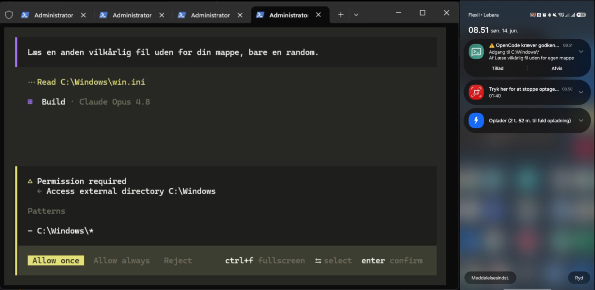

# OpenCode Mobile Approval

Et [OpenCode](https://opencode.ai) plugin der sender en **push-notifikation til din telefon**, når OpenCode beder om en tilladelse (permission), og lader dig **godkende eller afvise direkte fra mobilen**.

Hvis du ikke selv svarer i terminalen inden for et valgt antal sekunder, sendes anmodningen videre til telefonen via [ntfy.sh](https://ntfy.sh). Svarer du lokalt i tide, sendes der intet til mobilen.



> Til venstre beder OpenCode om adgang til `C:\Windows`. Til højre dukker den samme anmodning op som push på telefonen med **Tillad** og **Afvis**.

---

## Hvad er det?

OpenCode spørger om lov, før den fx læser filer uden for projektet, redigerer filer eller kører kommandoer. Normalt skal du sidde ved maskinen for at svare. Dette plugin gør at du kan gå væk fra skærmen og stadig styre OpenCode fra telefonen.

Det bruger ntfy.sh som transport (gratis, ingen konto nødvendig) og OpenCode's egen SDK-klient til at aflevere svaret tilbage i kørslen.

Permission-notifikationer bruger formatet:

- Titel: `OpenCode: Adgang`, `OpenCode: Læsning`, `OpenCode: Redigering`, `OpenCode: Kommando` eller `OpenCode: Andet`
- Body: `Til: <sti eller mønster>` efterfulgt af `Af: <session titel>`

---

## Sådan virker det

1. OpenCode udløser hændelsen `permission.asked`.
2. Pluginet starter en timer (standard 60 sek).
3. **Svarer du lokalt** i terminalen → hændelsen `permission.replied` rydder timeren. Intet sendes.
4. **Svarer du ikke i tide** → der sendes en ntfy-push til din telefon med to knapper:
   - **Tillad** → sender `once:<sessionID>:<permissionID>`
   - **Afvis** → sender `reject:<sessionID>:<permissionID>`
5. En baggrundslytter abonnerer på svar-kanalen. Når svaret kommer, afleveres det direkte tilbage til OpenCode via SDK-klienten, og kørslen fortsætter.

Beskeden på telefonen viser stien/mønsteret og projektets (sessionens) titel. Allerede sendte notifikationer kan også clears automatisk igen, når du er aktiv tilbage i OpenCode.

---

## Krav

- OpenCode (plugins indlæses fra plugin-mappen).
- [ntfy](https://ntfy.sh/) app på telefonen (iOS/Android) — eller web.
- Netadgang til `ntfy.sh`.

---

## Installation

1. **Læg pluginet i din OpenCode plugin-mappe**

   - Globalt: `~/.config/opencode/plugins/mobile-approval.js`
   - Eller pr. projekt: `.opencode/plugins/mobile-approval.js`

   På Windows er global-stien typisk:
   `C:\Users\<bruger>\.config\opencode\plugins\mobile-approval.js`

   Filer i disse mapper indlæses automatisk når OpenCode starter.

2. **Vælg dine egne kanalnavne** øverst i `mobile-approval.js`:

   ```js
   const NTFY_ANMODNING = "opencode-CHANGE-ME-xxxxxxxxxxxx";       // anmodninger ud
   const NTFY_SVAR      = "opencode-CHANGE-ME-xxxxxxxxxxxx-svar";   // svar ind
   ```

   Brug lange, tilfældige navne (se sikkerhedsnoten nedenfor).

3. **Abonnér på anmodnings-kanalen i ntfy-app'en**

   Tilføj `NTFY_ANMODNING` som emne/topic i ntfy-app'en på telefonen. Det er den kanal, notifikationerne sendes til.

4. **Start OpenCode.** Næste gang en permission ikke besvares lokalt inden for timeouten, får du den på telefonen.

---

## Settings

Alle indstillinger ligger i KONFIGURATION-blokken øverst i `mobile-approval.js`:

| Indstilling | Standard | Forklaring |
|---|---|---|
| `NTFY_ANMODNING` | `"opencode-CHANGE-ME-..."` | ntfy-kanal som notifikationerne **sendes til**. Den du abonnerer på i app'en. |
| `NTFY_SVAR` | `"opencode-CHANGE-ME-...-svar"` | ntfy-kanal som **svar** (Tillad/Afvis) sendes på og lyttes efter. Skal være forskellig fra anmodnings-kanalen. |
| `REMINDER_TIMEOUT_SECONDS` | `60` | Antal sekunder der ventes på lokalt svar, før der sendes til telefonen. Sæt fx `0` for at sende med det samme. |
| `LOG_FILE` | `os.tmpdir()/opencode-mobile-approval.log` | Sti til debug-loggen. |
| `NTFY_ICON_URL` | OpenCode-logo | Ikon der vises i notifikationen. |
| `DEBUG` | `true` | `true` skriver log til `LOG_FILE`; `false` slår logning fra. |
| `CLEAR_NOTIFICATIONS_ON_ACTIVITY` | `true` | Ryd sendte telefon-notifikationer når du er aktiv i OpenCode igen. |
| `CLEAR_ON_ACTIVITY_DEBOUNCE_MS` | `1000` | Mindste tid i ms mellem clear-bølger ved aktivitet. |

---

## Sikkerhed

ntfy.sh-kanaler er **offentlige** og virker som hemmelige tokens: alle der kender kanalnavnet kan læse beskederne. Notifikationen indeholder `sessionID` og `permissionID` i knapperne, så en der kender din anmodnings-kanal i princippet kan **godkende eller afvise på dine vegne**.

Derfor:

- Brug **lange, tilfældige og unikke** navne til begge kanaler.
- **Del dem ikke** og commit ikke dine rigtige navne til et offentligt repo.
- Vil du have stærkere beskyttelse: kør din **egen ntfy-server** med adgangskontrol og peg URL'erne derhen.

Notifikationerne kan også afsløre filstier og projektnavne — hav det med i overvejelsen.

---

## Permission-typer i beskeden

Pluginet oversætter OpenCode's permission-type til en kort dansk label i titlen:

| Type | Tekst |
|---|---|
| `external_directory` / `directory` | Adgang |
| `read_file` | Læsning |
| `write_file` / `edit` | Redigering |
| `bash` | Kommando |
| (andet) | Andet |

Titler med danske tegn RFC 2047-encodes automatisk, så fx `Læsning` og `Redigering` vises korrekt i ntfy-klienter der ellers erstatter UTF-8-tegn i headers.

---

## Fejlfinding

- **Ingen notifikation?** Tjek at du abonnerer på den rigtige `NTFY_ANMODNING`-kanal, og at timeouten er udløbet. Se `LOG_FILE`.
- **Svar virker ikke?** Tjek at `NTFY_SVAR` matcher i både plugin og knappernes URL (det gør den automatisk), og at telefonen har net.
- **Intet i loggen?** Sæt `DEBUG = true`.

---

## Licens

MIT
